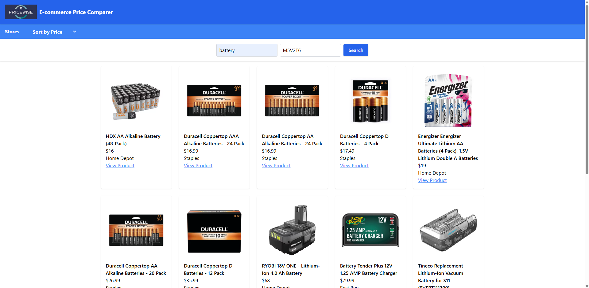
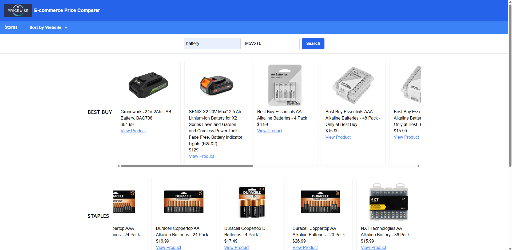

# E-commerce Price Tracker

This web app tracks product prices and availability from Amazon, Flipkart, and eBay. It can monitor price changes and send email alerts.

## Tech Stack
- Frontend: React
- Backend: FastAPI
- Scraping: Selenium

## Features
- Scrape prices and availability
- Track price changes
- Email notifications

## Setup
1. Install dependencies in `client` and `server` folders
2. Start frontend and backend servers

## To Do
- Implement scrapers
- Build UI
- Add email alerts

## To Run
- npm run dev /client
- uvicorn main:app --reload /server
